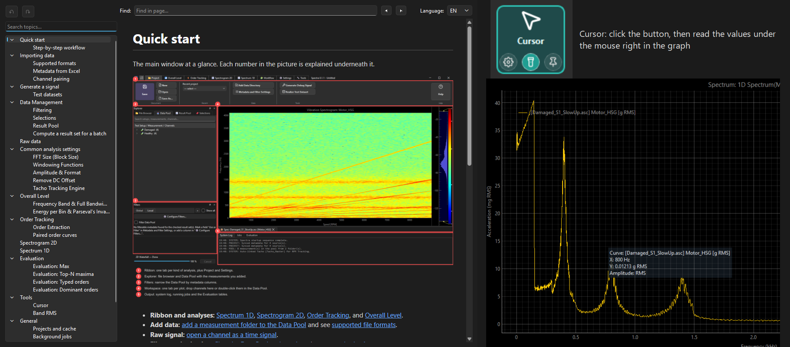

# Changelog

What changed in Spectra, written for users. Rules for writing it: [docs/agents/release.md](docs/agents/release.md).

## Unreleased

- Starting an Update no longer makes the window show "Not responding" while Windows scans the installer.

## 0.1.2 - 2026-10-08

- New Cursor on the Tools tab: hover a graph and read the values of the curve in a box right.
- Cursor Settings let you choose and order the fields the box shows.
- Highlight thickens the curve under the mouse and dims the others; Pin freezes the box in place.
- New built-in Help window with a quick start and a full reference, in English and Czech.
  
- Minor bug fixes.

## 0.1.1 - 2026-10-05

- Opening a project that is already open now brings its existing window to the front instead of opening a second one.

## 0.1.0 - 2026-10-05

- First public alpha: spectra, spectrograms, order tracking and trending across large sets of measurements.
