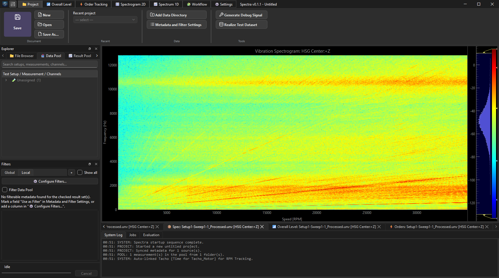
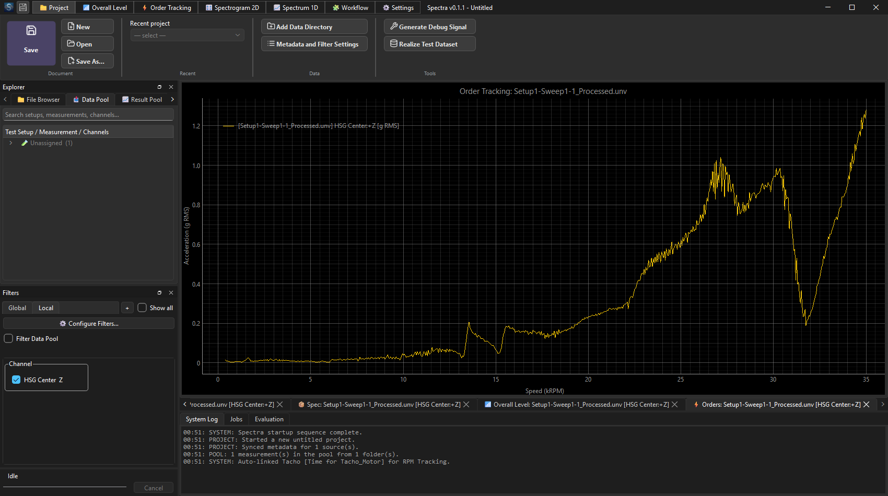
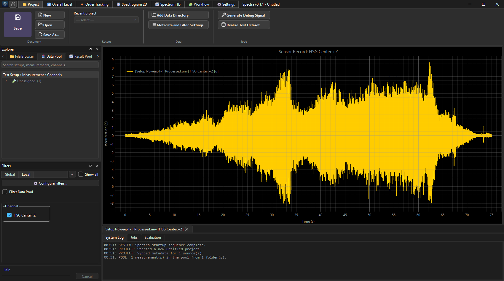
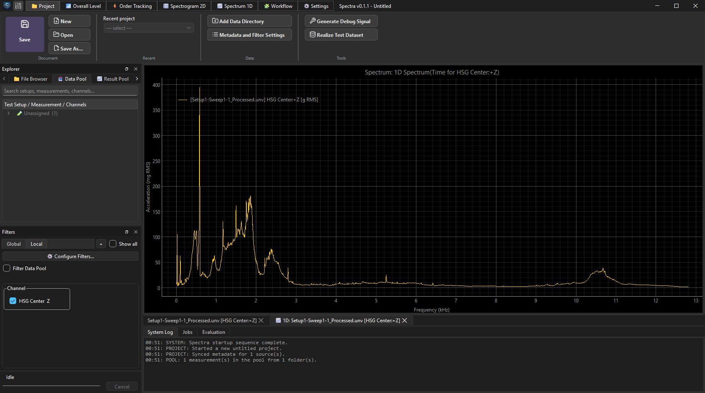
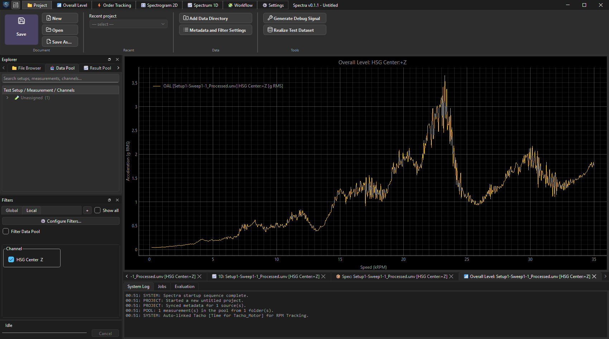

# Spectra

**NVH analysis for rotating machinery** — spectra, spectrograms, order tracking and
trending across large sets of measurements.

Compute, compare and trend measurements — from a single run-up to whole folders of them.

> **Status: first public alpha (0.1.x).** Windows only. Features marked *pre-alpha* may
> change or break between releases.

## Download

Get the installer from the
**[latest release](https://github.com/PredySvK/Spectra-releases/releases/latest)**
(`Spectra-<version>-setup.exe`). No admin rights needed; it installs per-user.
The installer is not code-signed yet, so Windows SmartScreen may warn — choose
*More info → Run anyway*. Installed copies check for updates themselves.

## What it can do

**Look at your data**
- **Raw data plots** — time signals and tacho/RPM channels, with cursors and zoom.
- **Spectrum** — averaged FFT with selectable window, overlap, averaging
  (linear / peak hold / exponential) and amplitude formats (peak, RMS, PSD, dB).
- **Spectrogram** — time/RPM–frequency maps for run-ups and run-downs.
- **Overall Level** — level of a frequency band as a function of RPM or time.
- **Order tracking** — order cuts followed along the tacho signal, with an
  *overall decomposition*: Overall Level split into the selected orders plus the
  residual that is left over.

**Work with many measurements**
- **Bulk computation with a cache** — compute a whole set of measurements in the
  background; results are stored in HDF5 and reused, so reopening is instant.
- **Filtering** — hide or show curves by channel, direction, order, file, metadata
  and parameter set; filter cards can be global or per graph.
- **Metadata from Excel** and **channel pairing** — attach your own columns to
  measurements and pair channels, then filter and compare by them.
- **Evaluation tables** — maximum, top-N peaks and dominant orders pulled out of
  curves into a table, exportable to CSV.
- **Workflow editor** *(pre-alpha)* — build a calculation as a block diagram and run
  it over a whole selection.

**Everyday comfort**
- Reads `.unv` and `.asc` measurements and MASTA simulation results (`.xlsx`); project files bundle your selections, filters
  and result sets.
- The UI never freezes: heavy work runs in the background with a job list and Cancel.
- Unit preferences, Native/Hz/RPM X axis, built-in help (English and Czech),
  recent projects and in-app updates.

## Gallery

## Quick start

1. Install and start Spectra, create a project (or open a recent one).
2. Drop a folder of `.unv` / `.asc` files into the file explorer.
3. Drag channels into a graph — raw signal first, then compute a spectrum,
   spectrogram or order tracking from the ribbon.
4. Use the Filters panel to narrow the curves, and the Evaluation table to compare.
